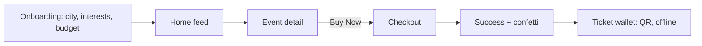
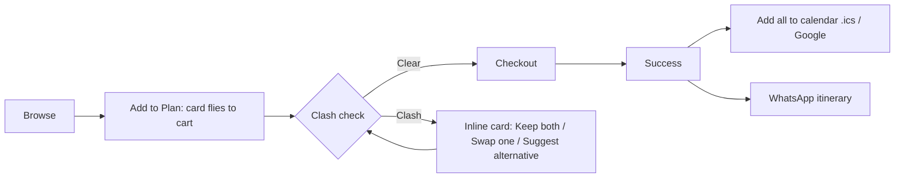
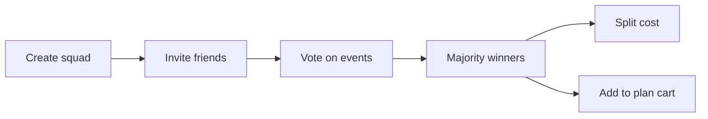
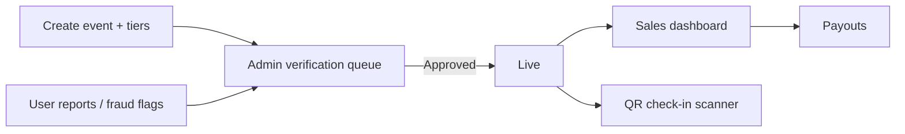

# CHO user flows

## Discover to ticket (MVP)

```mermaid
flowchart LR
  A[Onboarding: city, interests, budget] --> B[Home feed]
  B --> C[Event detail]
  C -->|Buy Now| D[Checkout]
  D --> E[Success + confetti]
  E --> F[Ticket wallet: QR, offline]
```

## COORDINA (V2)

```mermaid
flowchart LR
  A[Browse] --> B[Add to Plan: card flies to cart]
  B --> C{Clash check}
  C -->|Clear| E[Checkout]
  C -->|Clash| D[Inline card: Keep both / Swap one / Suggest alternative]
  D --> C
  E --> F[Success]
  F --> G[Add all to calendar .ics / Google]
  F --> H[WhatsApp itinerary]
```

## Squad mode (V3)

```mermaid
flowchart LR
  A[Create squad] --> B[Invite friends]
  B --> C[Vote on events]
  C --> D[Majority winners]
  D --> E[Split cost]
  D --> F[Add to plan cart]
```

## Organiser and Admin

```mermaid
flowchart LR
  O[Create event + tiers] --> V[Admin verification queue]
  V -->|Approved| L[Live]
  L --> S[Sales dashboard]
  L --> K[QR check-in scanner]
  S --> P[Payouts]
  R[User reports / fraud flags] --> V
```

